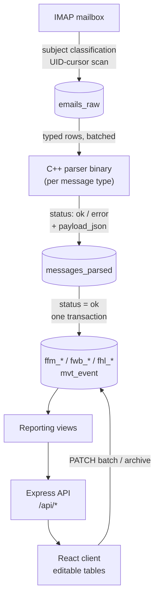

# CargoIMP-Compiler

Reads IATA Cargo-IMP cargo messages out of an airline mailbox, parses them with grammar-generated C++ parsers, and normalizes the result into a PostgreSQL database. An Express API and React front end uses this data to assist with day-to-day cargo operations, such as MAWB/HAWB/ULD tracking and pickup status.

In production against live mailbox traffic, the parser suite runs at an effectively 100% success rate. The remaining failures are messages that genuinely don't conform to the CIMP format, which are still recorded.

## Why a grammar instead of string-splitting

Cargo-IMP (IATA/A4A Resolution 670) is a format that's still in daily production use across the air cargo industry. It's not friendly to parse: a single message type has several incompatible wire revisions live in the same mailbox at once (`FFM/4`, `FFM/5`, `FFM/8` all show up), field boundaries are positional rather than tagged, and some structure is conditionally dropped entirely — a "loose"/bulk FFM shipment just omits its ULD line instead of encoding an empty one.

To address this format's complexity, each message type is treated as a formal language: an ABNF grammar defines what's structurally valid for a given revision, and a generated parser is the single source of truth for how a message decomposes into fields.

## The parsers

Each grammar (`cpp/data/grammars/*.abnf`) compiles through [aParse](https://www.parse2.com/) into its own C++ parser binary — one executable per message type. They're built as separate binaries rather than linked together into one, because aParse doesn't namespace its generated code; combining multiple grammars into a single binary would risk symbol collisions between them. 

The currently supported message types are those useful to our operations. New message types can be added by: a new grammar `*_grammar.abnf`, JSON extractor (`*_json_extractor.cpp`) , and CLI entrypoint (`*_json_main.cpp`) produce a working standalone parser with no changes to existing ones.

| Type | Formats | Content |
|------|---------|---------|
| FFM  | FFM/4, FFM/5, FFM/8 | Freight manifest — flight, routing, ULDs, AWBs |
| FWB  | FWB/17 | Master air waybill (MAWB) details |
| FHL  | FHL/4, FHL/5 | House waybill (HAWB) details under a MAWB |
| MVT  |  | Flight movement events (actual departure/arrival times) |

Building:

```bash
cd cpp
bash scripts/generate_parsers.sh data/grammars/fwb_grammar.abnf   # grammar -> generated C++
cmake -S . -B build && cmake --build build                        # -> cpp/build/parser_*_json
```

Compiling a grammar produces two layers, kept intentionally separate. `cpp/data/generated_parsers/` (build artifact so gitignored) is aParse's direct output: C++ code that parses a message into a tree mirroring the grammar's rules. It's regenerated from scratch on every grammar change. `cpp/src/*_json_extractor.cpp` is separate file that reads from that generated tree and pulls fields out into a fixed, usable JSON shape used by the actual data pipeline.

The point of the split: a grammar change can restructure the generated tree significantly, but as long as the extractor is updated to still walk it correctly, the JSON keys it produces stay the same. So, minor changes in the grammars never become a breaking change for the rest of the system.

### Standalone, dependency-free CLI

The binaries have no dependency on Node, Postgres, or the network — just the C++ standard library. Each one takes a message via `-file <path>` or `-string <text>` and prints JSON to stdout:

```bash
./build/parser_fwb_json -file data/input_tests/fwb_test.txt
./build/parser_ffm_json -file data/input_tests/ffm_test.txt
./build/parser_fhl_json -file data/input_tests/fhl_test.txt
./build/parser_mvt_json -file data/input_tests/mvt_test.txt
```

This is the same binary the pipeline shells out to (`spawnSync`, `server/scripts/pipeline/parser-runner.js`). Given a raw message on disk, it deterministically produces JSON or a diagnosed error with nothing else running, which makes it easy to embed in a totally different pipeline or use as a standalone CIMP decoding tool on its own.

## Design tradeoffs in the current implementation

**Classification on bad labels.** The subject line is a human- or system-authored label for the message that follows, and it disagrees with the body often enough to have caused real operational incidents: a message subject-tagged `FFM8` whose body is actually a `FWB17` results in a failed parse, so we have to request for the messages to be resent correctly. The system still trusts the subject for parser selection, on purpose: cross-checking the body would mean a full MIME parse of every message before even knowing what it is, which is too expensive to do unconditionally. A wrong subject just produces a grammar mismatch, which becomes a `status = 'error'` row instead of a silent misparse. Correctness comes from the grammar rejecting the wrong structure, not from getting classification right on the first try.

**HAWB-to-ULD allocation is underdetermined.** When a MAWB's freight is split across several ULDs, FFM gives per-ULD/per-AWB manifest entries, but FHL only gives per-house-bill weight and piece counts under the MAWB as a whole. No message states which portion of a given HAWB physically flew with which ULD. Given a MAWB's total weight spread across ULDs of different weights, and a set of HAWBs summing to that total, recovering the exact split is a constraint-satisfaction problem with more unknowns than equations, so there's no unique answers to compute. Rather than guess, the reporting logic classifies at the ULD level instead: `loose` if any MAWB inside it is still missing a matching FWB, `uld` once every MAWB in it has one. Since FWB messages arrive independently and out of order, the classification is flexible: a ULD can flip from `loose` to `uld` as later messages are received.

## Pipeline



1. **Extract** (`extract_to_db`) scans the IMAP mailbox by UID, checkpointed on the last-seen UID per mailbox so re-running never rescans old mail. Each message is classified from its subject alone (`FFM/*`, `FWB/*`, `FHL/*`, `MVT`, or a notification pattern like `RCF_933-34474602` carrying an embedded MAWB) and inserted into `emails_raw`. Full body parsing only happens for message-recognized types; notification-only mail is recorded without a body. 
2. **Parse** (`parse_to_db`) runs the matching parser binary as a subprocess against each raw row with a known type, and records `ok`/`error`, stdout/stderr, and `payload_json` into `messages_parsed`. Candidates are selected by `NOT EXISTS` against prior attempts, so a row is parsed at most once unless `--force` reprocesses a batch — handy after rebuilding a parser.
3. **Normalize** decomposes `payload_json` into per-type relational tables once a parse succeeds (e.g. `ffm_flight`, `fwb_master`, `mvt_event` — full set under [Repository layout](#repository-layout)). The parse-result insert and the normalization writes share one transaction per message, so nothing is ever left half-normalized after a crash mid-write.
4. **Serve**: an Express API (`/api/pipeline`, `/api/messages`, `/api/reports`) reads from reporting views/tables in Postgres.
5. **Display/edit**: a React (Vite) client renders the operational tables (MAWB, HAWB, ULD, pickup, and others) and writes edits back through `PATCH` endpoints. `client/src/lib/tableEdits.js` diffs the in-memory rows against what was last fetched and only ships changed, whitelisted-editable columns, so the server doesn't have to trust the client about what's editable.

Every run is itself observable as data — `pipeline_runs`/`pipeline_run_steps` rows plus a per-run JSON report under `server/data/logs/pipeline-runs/`, guarded by a PID lock file so overlapping runs refuse to start. Schema history lives in `server/migrations/` (node-pg-migrate) as an append-only record; `db/schema.sql` is a generated snapshot used to baseline a fresh database rather than a hand-maintained source of truth.

See [docs/app_flow.md](docs/app_flow.md) for the full data-flow spec, including a field-by-field reference of every parsed payload key.

Subject-only notification events (`RCF`, `Arrival Notice`, `Delivery Complete`, `Ready For Pick Up`, `DLV`, `NFD`) are also recognized and recorded against a MAWB without going through a CIMP parser at all. They roll up into `mawb_notification_status` / `has_*` flags on the New Messages and MAWB pages.

## Repository layout

```
cpp/                  Grammar-generated message parsers
  data/grammars/       ABNF grammars: ffm (236 lines), fwb (260), fhl (162), mvt (169)
  data/generated_parsers/  aParse-generated C++ (gitignored, built from grammars)
  data/input_tests/    Sample messages for each type
  src/                 Hand-written JSON extractor wrappers + CLI entrypoints
  scripts/             generate_parsers.sh (grammar -> generated C++), run_parser_with_input.sh
  tools/               aParse jars used to compile grammars into C++

server/               Express API + ingestion pipeline (npm workspace: ncaparser-server)
  src/
    server.js           HTTP entrypoint
    app.js               Express app wiring
    routes/              /api/pipeline, /api/messages, /api/reports
    controllers/         Request handling per route group
    services/            Business logic
    repositories/         SQL/query layer
    middleware/          error-handler, not-found
  scripts/
    run_pipeline.js       Pipeline orchestrator entrypoint (polling / --once / --force)
    pipeline/             workflow.js, parser-runner.js, normalizers.js, persistence.js, message-format.js
    migrate.js, migrate-baseline.js
  migrations/           node-pg-migrate migrations (schema evolution history)
  config/               db, env, imap, logger, messageTypes, parser, paths, pipeline
  data/                 Runtime output: raw emails, parsed JSON, logs, pipeline-run reports (gitignored)

client/               React + Vite front end (npm workspace: ncaparser-client)
  src/
    App.jsx              Path-based routing to each page
    pages/               IndexPage, NewMessagesPage, ParseErrorsPage, MawbTablePage, HawbTablePage,
                         UldTablePage, EmailXxxTablePage, OfficeOperationPage, PickupPage,
                         BreakdownManifestPage, NotFoundPage
    components/          DataTablePage.jsx (shared editable table component)
    constants/           Per-page column/table definitions
    lib/                 readJson.js, tableEdits.js (diff-based batch update builder)

db/                   PostgreSQL reference SQL
  schema.sql            Full schema/tables/views (source of truth for structure, also used by migrate-baseline)
  init.sql              One-time DB role/privilege setup for nca_cargo_user
  scripts.sql            Ad hoc reporting queries

docs/                 Design references
  app_flow.md           Authoritative backend data-flow spec (extraction -> parse -> normalize -> API)
  parsed-output-contract.md  (legacy) canonical parser JSON contract
  cimp-input-differences.md, CIMP-34thEdition2014.pdf/.txt  IATA Cargo-IMP format references (not tracked; see below)
  todo.md               Working notes on in-progress/planned features
```

> `docs/CIMP-34thEdition2014.pdf`/`.txt` are the IATA/A4A Cargo-IMP manual — a licensed publication, gitignored rather than redistributed. Get your own copy from IATA if you need the format reference; `docs/cimp-input-differences.md` covers the project's own notes on format variance without reproducing the manual.

## Setup & running

Npm workspace with two packages, `server` and `client`:

```bash
npm install   # installs both workspaces from the repo root
```

Create `server/.env`:

```bash
EMAIL_USER=...     # IMAP mailbox user
EMAIL_PASS=...     # IMAP mailbox password
DB_USER=...              # Postgres role (see db/init.sql)
DB_PASSWORD=...
PARSER_VERSION=...       # optional, recorded alongside parse attempts
```

Postgres connection defaults (host `127.0.0.1`, port `5432`, database `nca_cargo`) are fixed in `server/config/db.js`. Provision the database and role with `db/init.sql` first, then apply schema via migrations:

```bash
npm run db:migrate            # apply pending migrations
npm run db:migrate:down       # roll back one migration
npm run db:migrate:baseline   # baseline an existing DB against db/schema.sql
npm run db:migrate:create -- <name>   # scaffold a new migration
```

Running:

```bash
npm start              # start the Express API (server/src/server.js)
npm run dev             # start the Vite dev server for the client

npm run server:pipeline         # run the ingestion pipeline on a poll loop
npm run server:pipeline:once    # run one full pipeline cycle and exit
npm run server:pipeline:force   # run once, reprocessing a batch of already-typed raw rows
```

## API

All routes mounted under `/api` (`server/src/routes/index.js`):

- `GET /pipeline/runs`, `GET /pipeline/runs/:id` — pipeline run history/detail
- `GET /messages`, `GET /messages/:id` — parsed messages + parse diagnostics (joins `messages_parsed` with `emails_raw`)
- `GET /reports/mawbs` / `/hawbs` / `/ulds` and their `-table` variants — reporting views backing each client page
- `GET /reports/new-messages`, `GET /reports/email-xxx-table` — notification/event rollups
- `GET /reports/office-operation-table`, `GET /reports/pickup-table`, `GET /reports/breakdown-manifest-table` — operational tables
- `PATCH .../batch`, `PATCH .../archive-status`, `PATCH new-messages/archive` — editable-table write-back used by the client's diff-based batch updates (`client/src/lib/tableEdits.js`)