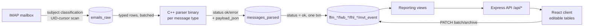

# CargoIMP-Compiler

CargoIMP-Compiler reads IATA Cargo-IMP teletype messages (FFM, FWB, FHL, MVT) from an airline mailbox, parses them with grammar-generated C++ parsers, normalizes them into PostgreSQL, and serves the results through an Express API to a React front end for day-to-day cargo operations (MAWB/HAWB/ULD tracking, office operations, pickup status).

## Motivation

Cargo-IMP (IATA/A4A Resolution 670) is not a modern serialization format — it's a fixed-token teletype standard from the telex era, still in production use across the air cargo industry. A single logical message type has multiple incompatible on-the-wire revisions in circulation simultaneously (e.g. `FFM/4`, `FFM/5`, `FFM/8` all appear in the same mailbox), field boundaries are positional/delimiter-based rather than tagged, and some structural elements are conditionally omitted (a "loose"/bulk FFM shipment simply drops its ULD line rather than encoding an empty one). Ad hoc string-splitting degrades silently on the first message that deviates from whatever sample motivated it. This project instead treats each message type as a formal language: an ABNF grammar defines what's structurally valid for that revision, and a generated parser is the single source of truth for how a message decomposes into fields — so the accepted-language rules are declarative and version-controlled next to the message-format documentation, not implicit in hand-written conditionals.

## Architecture



1. **Extract** (`extract_to_db`) — incrementally scans the IMAP mailbox by UID (checkpointed on `MAX(uid)` already stored per mailbox, so re-running never rescans old mail), classifies each message from its subject line only (`FFM/*`, `FWB/*`, `FHL/*`, `MVT`, or a notification pattern like `RCF`/`Arrival Notice`/`DLV`/`NFD` with an embedded MAWB, e.g. `RCF_933-34474602`), and upserts into `emails_raw` (`ON CONFLICT (mailbox, uid) DO UPDATE`, so re-extraction is idempotent). Full MIME parsing only runs for subject-recognized types — notification-only mail is recorded without a body.
2. **Parse** (`parse_to_db`) — for raw rows with a known `message_type`, runs the matching C++ parser binary as a subprocess against the stored body and records the outcome (`ok`/`error`, stdout/stderr, `payload_json`) into `messages_parsed`. Candidate selection is `NOT EXISTS` against prior parse attempts (each row parsed at most once) unless `--force` re-parses a batch by UID order — useful when a parser has been rebuilt.
3. **Normalize** — on `status = ok`, decomposes `payload_json` into per-type relational tables (`ffm_flight`/`ffm_route`/`ffm_uld`/`ffm_awb`, `fwb_master`/`fwb_flight_booking`/`fwb_routing_leg`, `fhl_master`/`fhl_house`, `mvt_event`). The parse-result insert and the normalization writes share one `BEGIN`/`COMMIT` per message, so a message is never left half-normalized after a crash or query error.
4. **Serve** — an Express API (`/api/pipeline`, `/api/messages`, `/api/reports`) reads from reporting views/tables in Postgres.
5. **Display/edit** — a React (Vite) client renders operational tables (MAWB, HAWB, ULD, office operations, pickup, breakdown manifest, new messages, parse errors) and writes back edits (AMS/notes/storage, pickup status, archive state) via `PATCH` endpoints, using a diff-based batch-update builder (`client/src/lib/tableEdits.js`) that only sends changed, whitelisted-editable columns.

Every pipeline run is itself observable as data: `pipeline_runs`/`pipeline_run_steps` rows plus a per-run JSON report under `server/data/logs/pipeline-runs/`, guarded by a PID lock file so overlapping runs refuse to start. See [docs/app_flow.md](docs/app_flow.md) for the full backend data-flow spec, including a field-by-field reference of every parsed payload key for FFM/FWB/FHL/MVT.

## Design decisions

- **One executable per grammar, not one parser for all message types.** `cpp/CMakeLists.txt` builds each generated grammar into an isolated binary specifically to avoid symbol collisions between aParse-generated code across grammars — the alternative (linking all generated parsers into one binary) was rejected because the generator doesn't namespace its output.
- **Generated parse tree vs. hand-written JSON extraction are separate layers.** `cpp/data/generated_parsers/` is disposable output of `generate_parsers.sh` (never hand-edited, gitignored); `cpp/src/*_json_extractor.cpp` is hand-written code that walks the generated parse tree and emits the stable JSON contract. Regenerating a grammar can't silently change the API surface the rest of the system depends on.
- **Subject-only classification, by design, not by oversight.** Only the subject line picks the message type/parser binary — there is deliberately no fallback that cross-checks the body. This trades robustness against subject/body mismatches (a real, previously-observed failure mode — see Technical Challenges) for keeping the extraction stage cheap enough to run before committing to a full MIME parse of every message in the mailbox.
- **Parse failures are data, not exceptions.** A parser crash or grammar-rejection is stored as `messages_parsed.status = 'error'` with `stderr`/`stdout` preserved, surfaced through `/api/messages?status=error` and the client's Parse Errors page, rather than being logged and dropped. Nothing about a message's fate is invisible to an operator.
- **Migrations, not a single schema file, are the source of truth for schema history.** `server/migrations/` (node-pg-migrate) is the append-only record of how the schema evolved; `db/schema.sql` is a generated-reference snapshot of the current shape, used to baseline a fresh database rather than to hand-apply changes.
- **Editable client tables diff against last-fetched state, not against a form.** `client/src/lib/tableEdits.js` compares the current in-memory rows to the originally-fetched rows column-by-column, rejects writes to non-whitelisted columns, and only ships an update for rows that actually changed — so a `PATCH .../batch` payload is minimal and server-side validation of "is this column editable" doesn't rely on the client behaving.

## Technical challenges

**Classification under noisy labels.** The subject line is a human/system-authored label for the message that follows, and it disagrees with the body often enough to have been a recurring operational issue historically (a message subject-tagged `FFM8` whose body is actually a `FWB17` is not hypothetical). The current design (see Design decisions) accepts the subject as ground truth for parser selection and lets a resulting grammar mismatch surface as a `status = 'error'` parse row rather than silently mis-parsing — correctness is enforced by the grammar rejecting the wrong structure, not by classification being right the first time. A body-aware classifier would close this gap but adds a full MIME-parse cost to every mailbox scan.

**HAWB-to-ULD allocation is underdetermined.** When a MAWB's freight is split across multiple ULDs, FFM gives per-ULD/per-AWB manifest entries but FHL gives per-house-bill weight/piece counts under the MAWB as a whole — there is no message that states which portion of a given HAWB physically rode in which ULD. Given a MAWB's total weight distributed across several ULDs with distinct individual weights, and a set of HAWBs summing to that total, the exact allocation is a constraint-satisfaction problem with more unknowns than equations: multiple allocations reproduce the same marginal totals. Rather than attempt an allocation, `report_uld`/`build`-side logic classifies at the ULD level only: a ULD is `loose` if any MAWB inside it is missing a corresponding FWB, and `uld` once every MAWB in it has one — a decidable, coarser question that sidesteps the underdetermined one. Because FWB messages arrive independently and out of order, this classification is not monotonic: a ULD can flip from `loose` to `uld` as later FWB messages arrive.

## Repository layout

```
cpp/                  Grammar-generated message parsers
  data/grammars/       ABNF grammars: ffm (236 lines), fwb (260), fhl (162), mvt (169)
  data/generated_parsers/  aParse-generated C++ (gitignored, built from grammars)
  data/input_tests/    Sample messages for each type
  src/                 Hand-written JSON extractor wrappers + CLI entrypoints
  scripts/             generate_parsers.sh (grammar -> generated C++), run_parser_with_input.sh
  tools/               aParse jars used to compile grammars into C++

server/               Express API + ingestion pipeline (npm workspace: ncaparser-server)
  src/
    server.js           HTTP entrypoint
    app.js               Express app wiring
    routes/              /api/pipeline, /api/messages, /api/reports
    controllers/         Request handling per route group
    services/            Business logic
    repositories/         SQL/query layer
    middleware/          error-handler, not-found
  scripts/
    run_pipeline.js       Pipeline orchestrator entrypoint (polling / --once / --force)
    pipeline/             workflow.js, parser-runner.js, normalizers.js, persistence.js, message-format.js
    migrate.js, migrate-baseline.js
  migrations/           node-pg-migrate migrations (schema evolution history)
  config/               db, env, imap, logger, messageTypes, parser, paths, pipeline
  data/                 Runtime output: raw emails, parsed JSON, logs, pipeline-run reports (gitignored)

client/               React + Vite front end (npm workspace: ncaparser-client)
  src/
    App.jsx              Path-based routing to each page
    pages/               IndexPage, NewMessagesPage, ParseErrorsPage, MawbTablePage, HawbTablePage,
                         UldTablePage, EmailXxxTablePage, OfficeOperationPage, PickupPage,
                         BreakdownManifestPage, NotFoundPage
    components/          DataTablePage.jsx (shared editable table component)
    constants/           Per-page column/table definitions
    lib/                 readJson.js, tableEdits.js (diff-based batch update builder)

db/                   PostgreSQL reference SQL
  schema.sql            Full schema/tables/views (source of truth for structure, also used by migrate-baseline)
  init.sql              One-time DB role/privilege setup for nca_cargo_user
  scripts.sql            Ad hoc reporting queries

docs/                 Design references
  app_flow.md           Authoritative backend data-flow spec (extraction -> parse -> normalize -> API)
  parsed-output-contract.md  (legacy) canonical parser JSON contract
  cimp-input-differences.md, CIMP-34thEdition2014.pdf/.txt  IATA Cargo-IMP format references (not tracked; see below)
  todo.md               Working notes on in-progress/planned features
```

> `docs/CIMP-34thEdition2014.pdf`/`.txt` are the IATA/A4A Cargo-IMP manual — a licensed publication, intentionally gitignored rather than redistributed. Obtain your own copy from IATA if you need the format reference; `docs/cimp-input-differences.md` documents the project's own notes on format variance without reproducing the manual.

## Message types

| Type | Formats supported | Purpose |
|------|--------------------|---------|
| FFM  | FFM/4, FFM/5, FFM/8 | Freight manifest — flight, routing, ULDs, AWBs |
| FWB  | FWB/17 | Master air waybill (MAWB) details |
| FHL  | FHL/4, FHL/5 | House waybill (HAWB) details under a MAWB |
| MVT  | — | Flight movement events (actual departure/arrival times) |

Subject-only notification events (`RCF`, `Arrival Notice`, `Delivery Complete`, `Ready For Pick Up`, `DLV`, `NFD`) are also recognized and recorded against a MAWB without going through a CIMP parser; they roll up into `mawb_notification_status` / `has_*` flags used by the New Messages and MAWB pages.

## Building the parsers

Grammars live in `cpp/data/grammars/*.abnf`. To (re)generate the C++ parser sources for a grammar:

```bash
cd cpp
bash scripts/generate_parsers.sh data/grammars/fwb_grammar.abnf
```

Then configure and build all parser executables with CMake:

```bash
cd cpp
cmake -S . -B build
cmake --build build
```

This produces one executable per message type in `cpp/build/` (e.g. `parser_fwb_json`). Each can be run directly against a sample or real message:

```bash
./build/parser_fwb_json -file data/input_tests/fwb_test.txt
./build/parser_ffm_json -file data/input_tests/ffm_test.txt
./build/parser_fhl_json -file data/input_tests/fhl_test.txt
./build/parser_mvt_json -file data/input_tests/mvt_test.txt
```

## Setup

This is an npm workspace with two packages: `server` and `client`.

```bash
npm install   # installs both workspaces from the repo root
```

### Environment

Create `server/.env` with:

```bash
ALIMAIL_NCA_USER=...     # IMAP mailbox user
ALIMAIL_NCA_PASS=...     # IMAP mailbox password
DB_USER=...              # Postgres role (see db/init.sql)
DB_PASSWORD=...
PARSER_VERSION=...       # optional, recorded alongside parse attempts
```

Postgres connection defaults (host `127.0.0.1`, port `5432`, database `nca_cargo`) are fixed in `server/config/db.js`. Provision the database and role first with `db/init.sql`, then apply schema via migrations (below).

### Database

Schema evolves through `node-pg-migrate` migrations in `server/migrations/`. `db/schema.sql` is a full reference snapshot of the resulting structure/views.

```bash
npm run db:migrate            # apply pending migrations
npm run db:migrate:down       # roll back one migration
npm run db:migrate:baseline   # baseline an existing DB against db/schema.sql
npm run db:migrate:create -- <name>   # scaffold a new migration
```

## Running

```bash
npm start              # start the Express API (server/src/server.js)
npm run dev             # start the Vite dev server for the client

npm run server:pipeline         # run the ingestion pipeline on a poll loop
npm run server:pipeline:once    # run one full pipeline cycle and exit
npm run server:pipeline:force   # run once, reprocessing a batch of already-typed raw rows
```

## API

All routes are mounted under `/api` (`server/src/routes/index.js`):

- `GET /health` — DB reachability check
- `GET /pipeline/runs`, `GET /pipeline/runs/:id` — pipeline run history/detail
- `GET /messages`, `GET /messages/:id` — parsed messages + parse diagnostics (joins `messages_parsed` with `emails_raw`)
- `GET /reports/mawbs` / `/hawbs` / `/ulds` and their `-table` variants — reporting views backing each client page
- `GET /reports/new-messages`, `GET /reports/email-xxx-table` — notification/event rollups
- `GET /reports/office-operation-table`, `GET /reports/pickup-table`, `GET /reports/breakdown-manifest-table` — operational tables
- `PATCH .../batch`, `PATCH .../archive-status`, `PATCH new-messages/archive` — editable-table write-back used by the client's diff-based batch updates (`client/src/lib/tableEdits.js`)

See [docs/app_flow.md](docs/app_flow.md) for the full request/data flow, including which fields come from which parser payload.
